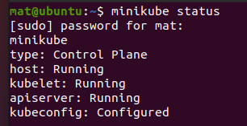
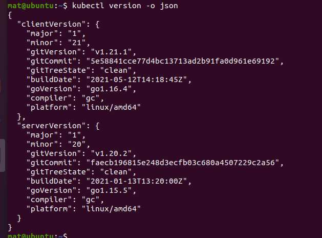
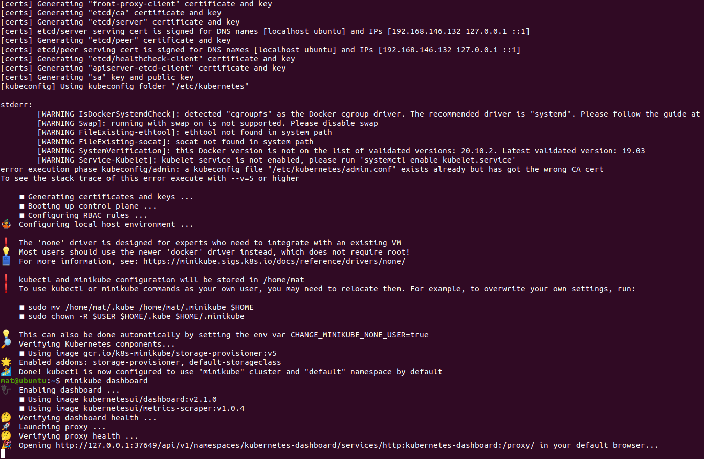
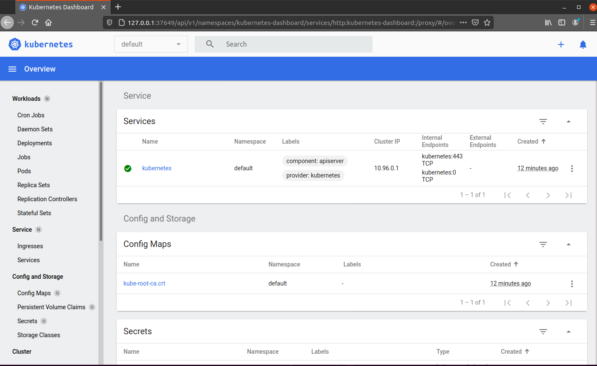
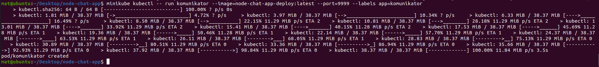
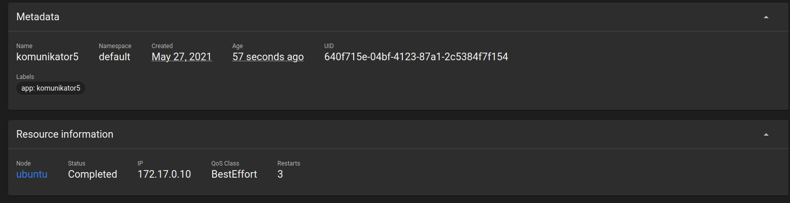
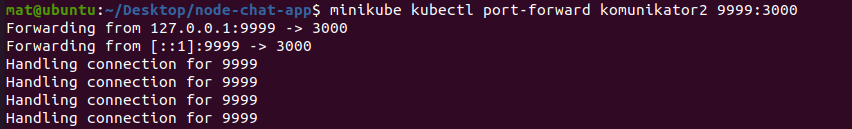
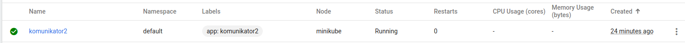
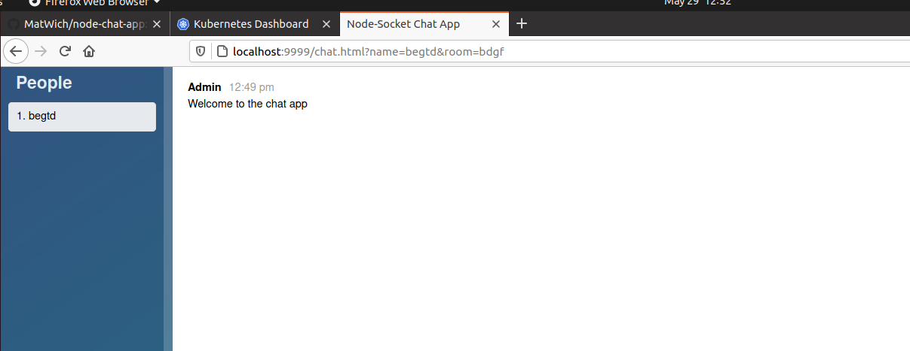

# Instalacja kubernetesa

```
$ sudo apt-get update -y
$ sudo apt-get upgrade -y
$ sudo apt-get install curl
$ sudo apt-get installl apt-transport-https
$ sudo apt install virtualbox virtualbox-ext-pack
$ wget https://storage.googleapis.com/minikube/releases/latest/minikube-linux-amd64
$ sudo cp minikube-linux-amd64 /usr/local/bin/minikube
sudo chmod 755 /usr/local/bin/minikube
```
# sprawdzenie czy jest ok
```commandline
    minikube version
```



# Instalacja Kubectl
```
curl -LO https://storage.googleapis.com/kubernetes-release/release/`curl -s https://storage.googleapis.com/kubernetes-release/release/stable.txt`/bin/linux/amd64/kubectl
chmod +x ./kubectl
sudo mv ./kubectl /usr/local/bin/kubectl
```

# sprawdzenie
```commandline
kubectl version -o json
```


# Odpalenie kubenetesa 
```commandline
minikube start
```


# dashboard


# uruchomienie kontenera w kubernetesie


```commandline
minikube kubectl -- run komunikator --image=node-chat-app-deploy:latest --port=9999 --labels app=komunikator
```

# kubenetes pod


# port forwarding


# pod w dashboardzie


# dzialajaca apka
