## 1
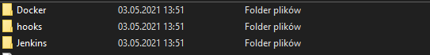

## 2
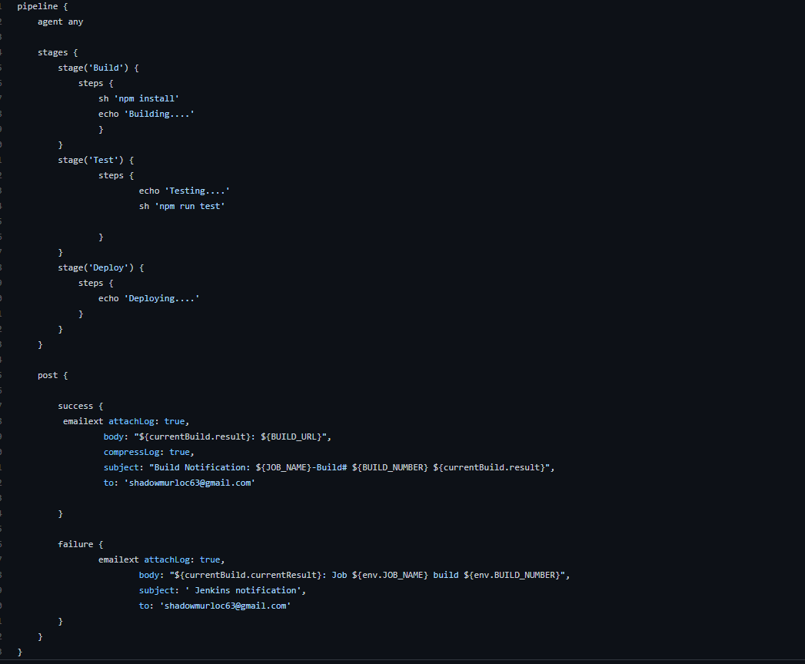

## 3 

Skonfigurowałem server SMTP dla gmaila oraz takze ten z 
mozliwością dołączenia załącznika.
Dla maila bez zalacznika 
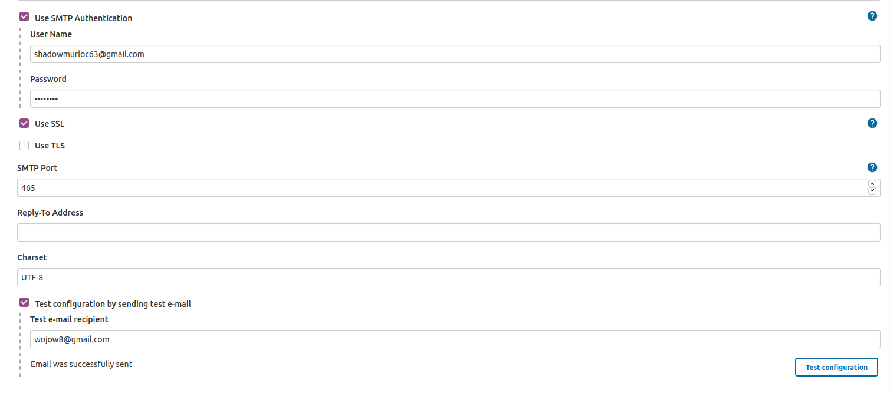

<strong>Mail testowy</strong> 
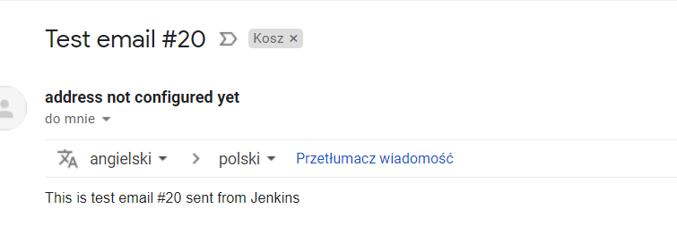

Dla maila z zalacznikiem 
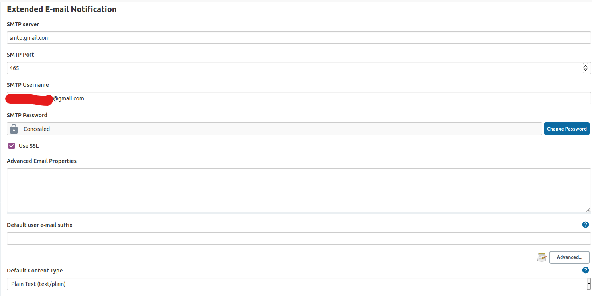

PIPELINE 
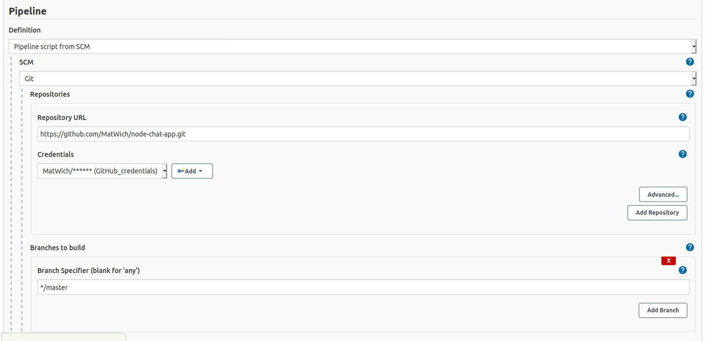

logi z wysylania maila 

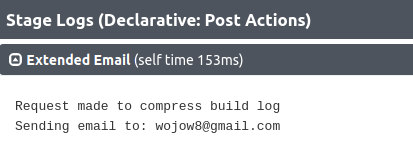

mail zwrotny od Jenkinsa przy pipelinie zwracajacym bledy 
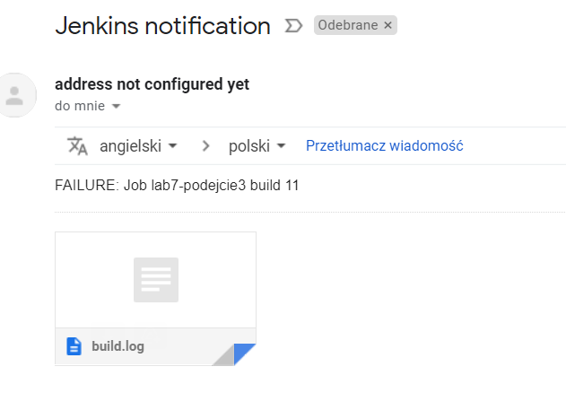

Udany build po ustawieniu toolsow w Jenkinsie
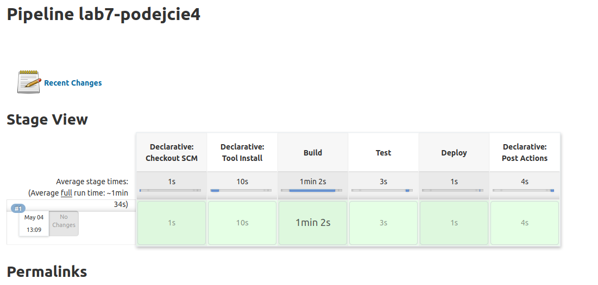

Mail z powiadomieniem
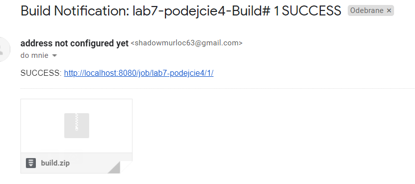

## 4
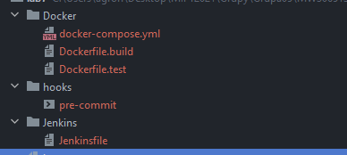