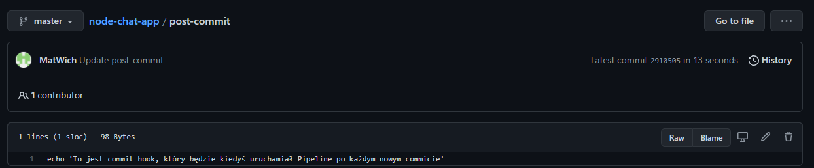

# 1, 2, 3
Stage 'Build' byl juz gotowy na poprzednich labolatoriach w celu 
odpalenia testow zeby przeszly

wszytko co znajduje sie w script jest dodane tylko 
po to zeby przetestowac
w jak najlatwiejszy sposob co sie dzieje w pipelinie jak 
stage 'Build' nie przejdzie.
Dlatego tez dodalem warunek w stage 'Test' 
 
pipeline jest automatycznie przerywany  
 
logi z stage 'Test' 
 
pojawia sie dokladnie ta sama wiadomosc, ktora dalem w Jenkinsfile 

Efekt po wykomentowaniu tego "zaklamania rzeczywistosci" 
 
# 4
Dodalem post-commita do repo z komunikatorem 
