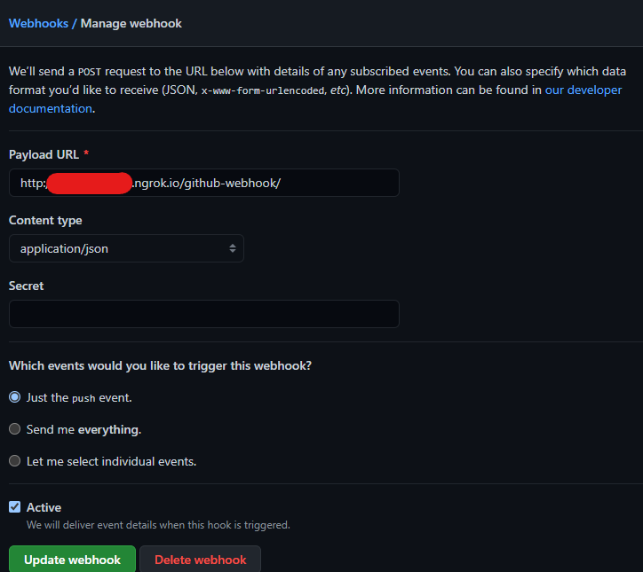
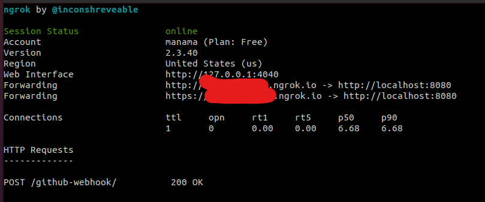
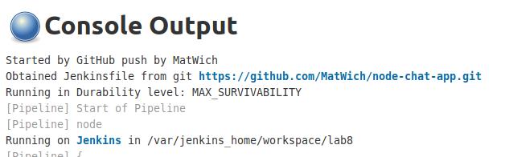
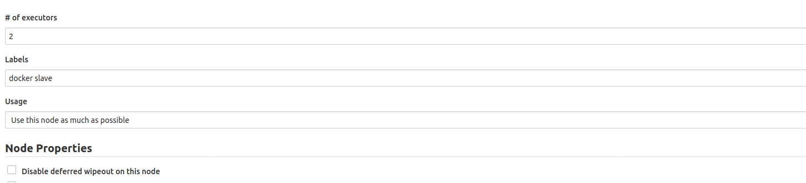
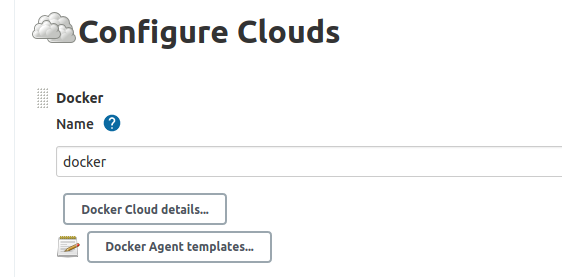
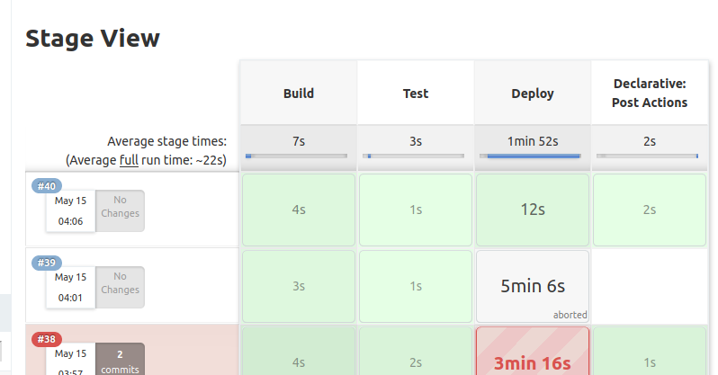
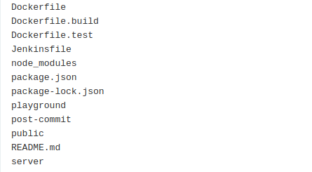

## 1

z racji tego ze kontener z jenkinsem mam na localhoscie
pobralem program z  https://ngrok.com/
pozwalajacy mi wysylac <strong>co chce</strong> w swiat

konto zalozylem z pomoca 10 minutes mail

Odpalilem ngroka z portem na ktorym mam swoojego jenkinsa

## 2
zrobilem nowego pusha na mastera z na moim repo z komunikatorem
i odpalil mi sie automatycznie build i rzeczywiscie wystarczylo 
uzyc <strong>mocy wzroku</strong> zeby zobaczyc ze ten build zostal 
uruchomiony automatycznie  

## 3 
rozszerzylem swojego Jenkinsfile a stage depoly i zmodyfikowalem agenta zeby
trzeba bylo go ustawia w kazdym stage osobno (patrz Jenkins/Jenkinsfile)

poza tym utworzylem clouda dockerowego oraz dodalem jego label do noda master
(na maszynie rowniez pobralem obraz jenkins/slave) 
Node 

Cloud 

pliki przerzucone  

widac pliki ktore stashowalem tj. package-json.lock i node_modules